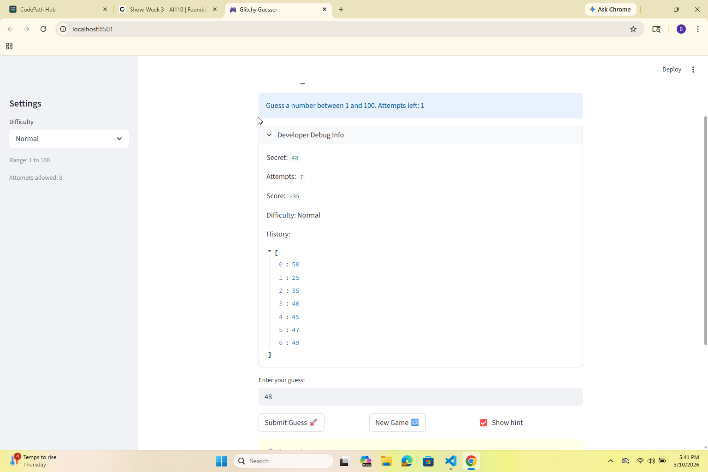

# 🎮 Game Glitch Investigator: The Impossible Guesser

## 🚨 The Situation

You asked an AI to build a simple "Number Guessing Game" using Streamlit.
It wrote the code, ran away, and now the game is unplayable. 

- You can't win.
- The hints lie to you.
- The secret number seems to have commitment issues.

## 🛠️ Setup

1. Install dependencies: `pip install -r requirements.txt`
2. Run the broken app: `python -m streamlit run app.py`

## 🕵️‍♂️ Your Mission

1. **Play the game.** Open the "Developer Debug Info" tab in the app to see the secret number. Try to win.
2. **Find the State Bug.** Why does the secret number change every time you click "Submit"? Ask ChatGPT: *"How do I keep a variable from resetting in Streamlit when I click a button?"*
3. **Fix the Logic.** The hints ("Higher/Lower") are wrong. Fix them.
4. **Refactor & Test.** - Move the logic into `logic_utils.py`.
   - Run `pytest` in your terminal.
   - Keep fixing until all tests pass!

## 📝 Document Your Experience

- [] Describe the game's purpose.
   The purpose of this game is to let the player guess a secret number within a limited number of attempts based on the selected difficulty. The app gives feedback after each guess and tracks attempts, score, and guess history.
- [] Detail which bugs you found.
   I found three main bugs: the hint direction was wrong which was "Too High" and "Too Low" feedback was misleading, game logic and UI logic were mixed together in one file, and state behavior around gameplay was inconsistent enough to make debugging harder.
- [] Explain what fixes you applied.
   I refactored core functions like get_range_for_difficulty, parse_guess, check_guess, update_score into logic_utils.py, updated app.py to import and use them, and fixed hint mapping so outcomes now match the correct "Go LOWER" or "Go HIGHER" message.

## 📸 Demo

- [ ] []

## 🚀 Stretch Features

- [ ] [If you choose to complete Challenge 4, insert a screenshot of your Enhanced Game UI here]
